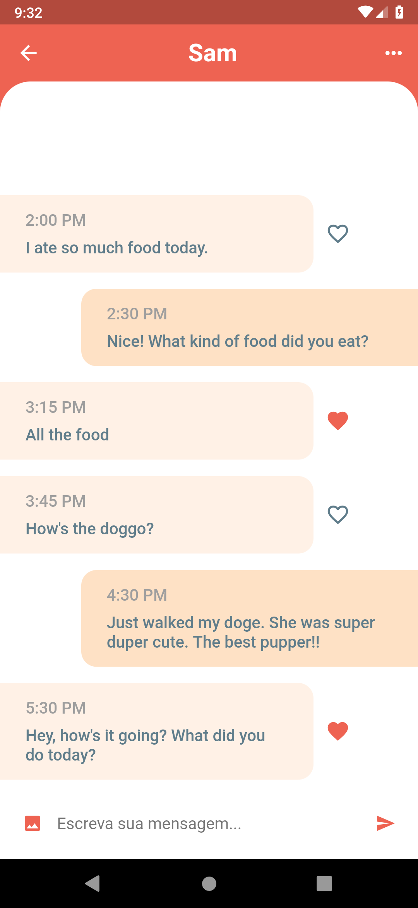
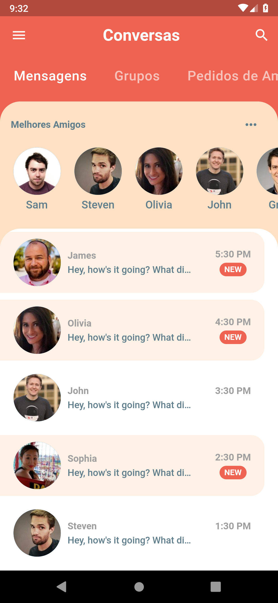

<h1 align="center">
    Flutter Chat UI
</h1>

  <a href="#zap-getting-started">Getting Started</a>&nbsp;&nbsp;&nbsp;|&nbsp;&nbsp;&nbsp;
  <a href="#screenshots">Screenshots</a>&nbsp;&nbsp;&nbsp;|&nbsp;&nbsp;&nbsp;
  <a href="#project">Project</a>&nbsp;&nbsp;&nbsp;|&nbsp;&nbsp;&nbsp;
  <a href="#ok_man-author">Author</a>&nbsp;&nbsp;&nbsp;|&nbsp;&nbsp;&nbsp;
  <a href="#memo-license">License</a>

This is a simple chat app UI written in Flutter, without any backend.

## :zap: Getting started

Make sure you have correctly installed Flutter and Android SDK, or iOS SDK if you are on macOS. Then just execute `flutter run`.

## 📸 Screenshots

  
  

## 💻 Project

This project was done following Marcus Ng's [tutorial at youtube](https://www.youtube.com/watch?v=h-igXZCCrrc&t=1378s). The purpose is to master Flutter for building mobile applications.

## :ok_man: Author
| |
|:---------------------:|
|  [Bruno Lombardi](https://github.com/bruno-lombardi)   |

## :memo: License

This project is under license MIT. See [LICENSE](LICENSE.md) for more details.
